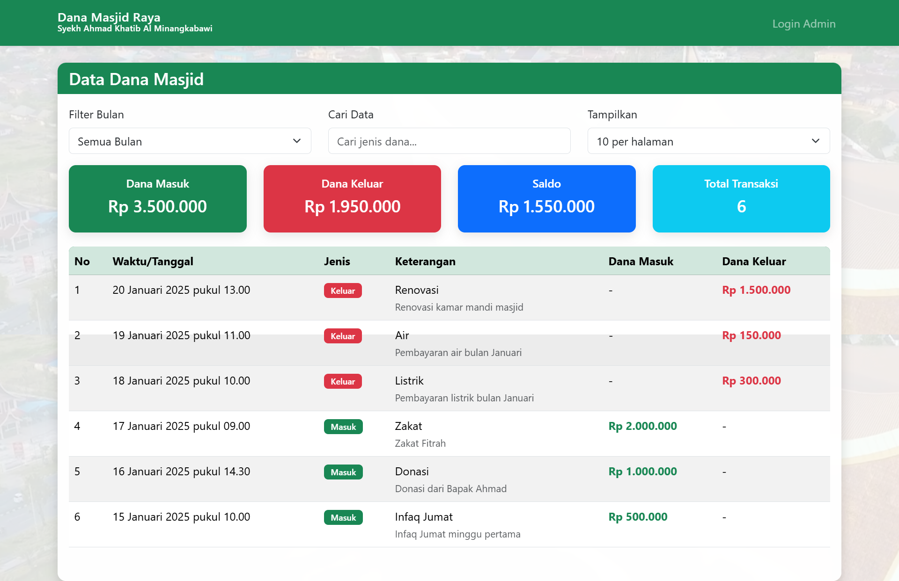
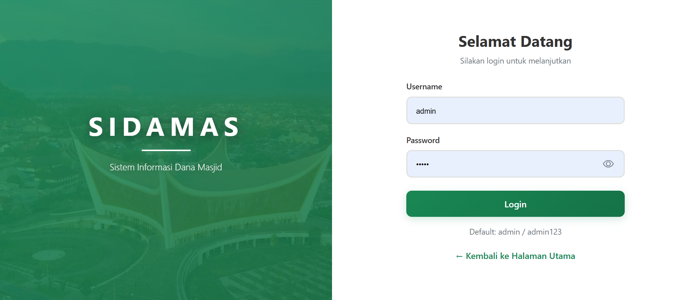
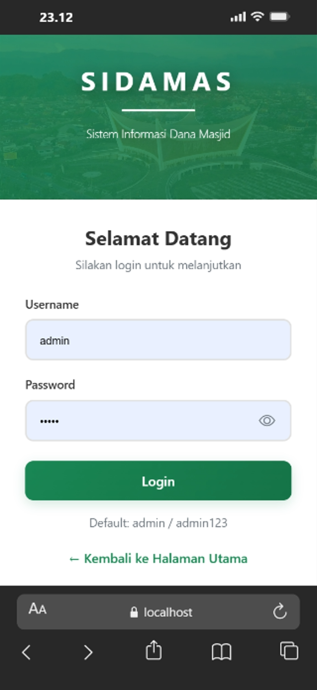
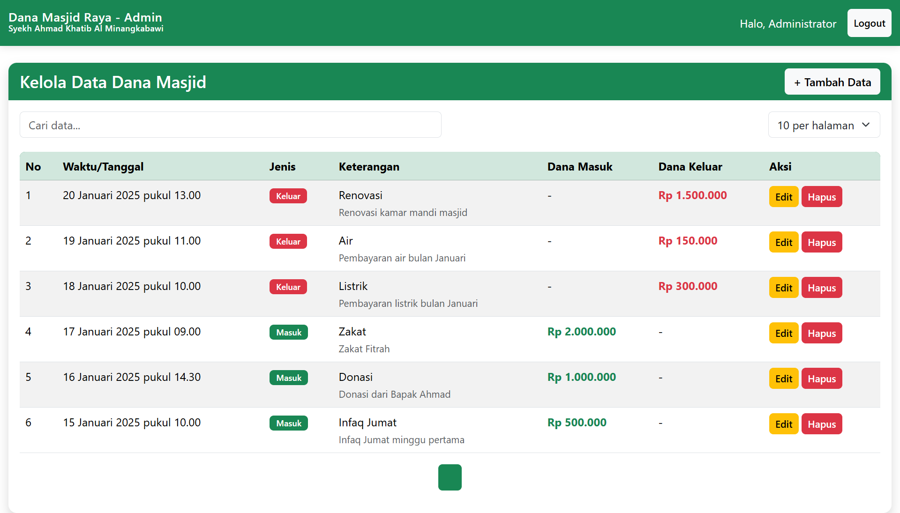
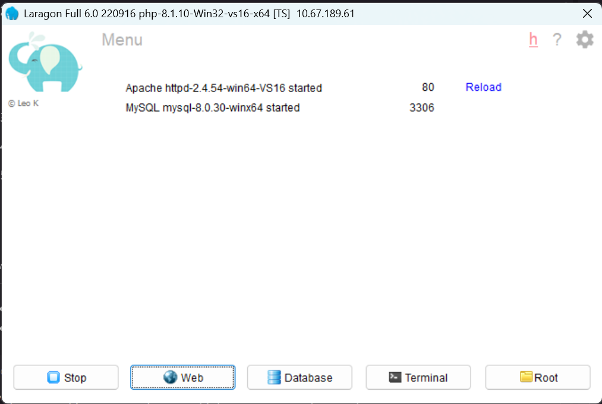
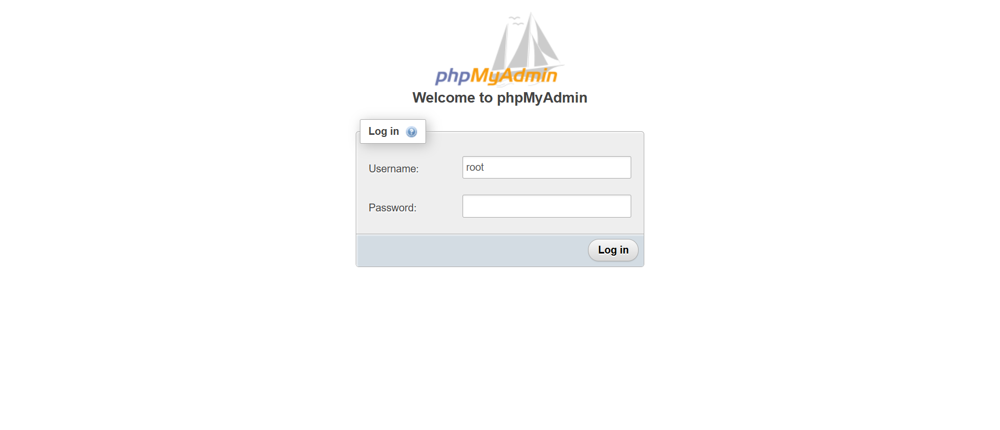
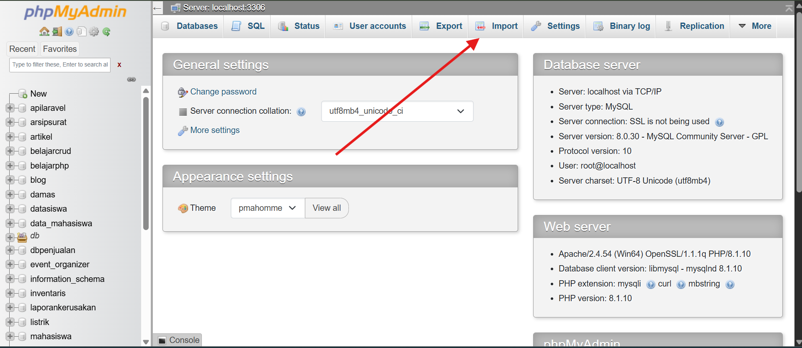
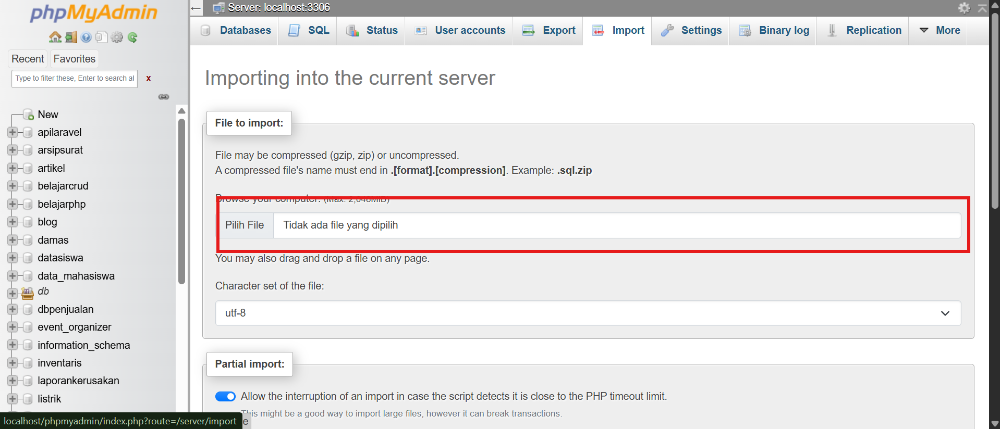

# SIDAMAS - Sistem Informasi Dana Masjid

SIDAMAS adalah sistem informasi untuk mengelola dana masjid secara transparan dan akuntabel. Aplikasi ini memudahkan pencatatan pemasukan dan pengeluaran dana masjid dengan interface yang modern dan user-friendly.

## Fitur Utama

- Dashboard Interaktif - Monitoring dana masuk, keluar, dan saldo secara real-time
- Manajemen Transaksi - Catat pemasukan dan pengeluaran dengan mudah
- Pencarian & Filter - Cari data berdasarkan jenis dana atau bulan tertentu
- Responsive Design - Dapat diakses dari desktop, tablet, dan smartphone
- Modern UI - Interface modern dengan video background
- Sistem Login - Keamanan data dengan autentikasi admin

## Screenshot

### Halaman Utama


### Halaman Login Admin


### Halaman Login Mobile


### Dashboard Admin


## Instalasi

1. Buka folder root web server:
   - **XAMPP:** `C:\xampp\htdocs`
   - **Laragon:** `C:\laragon\www`

2. Clone repository:
   ```bash
   git clone https://github.com/Rifaldo-dev/SIDAMAS
   cd SIDAMAS
   ```

3. Pastikan sudah **Start All** di panel Laragon/XAMPP:

   

4. Import database `damas.sql` ke MySQL:
   
   a. Login ke phpMyAdmin:
   
   
   
   b. Pilih menu **Import**:
   
   
   
   c. Klik **Choose File** dan pilih file `damas.sql`:
   
   
   
   d. Klik tombol **Import** di bagian bawah

5. Konfigurasi koneksi database di file `koneksi.php` sesuai dengan setting MySQL Anda (jika diperlukan)

6. Akses aplikasi melalui browser:
   - **XAMPP:** `http://localhost/SIDAMAS`
   - **Laragon:** `http://localhost/SIDAMAS`

## Default Login

- **Username:** admin
- **Password:** admin123

